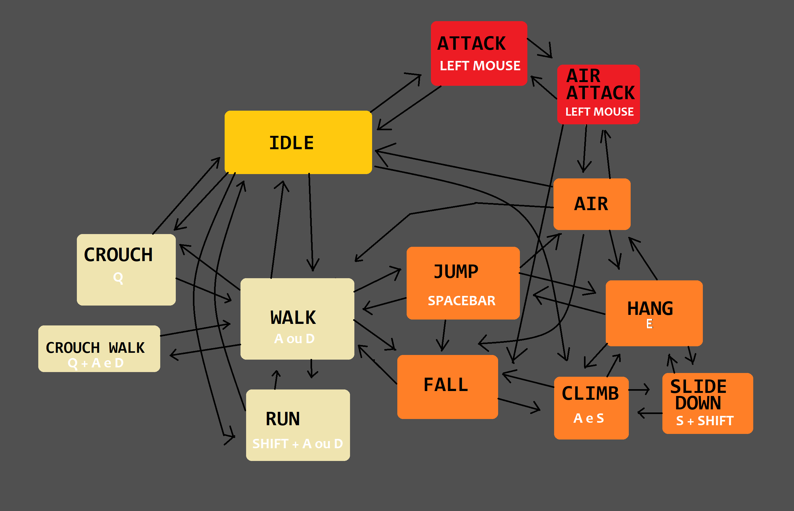

# TRABALHO UNEB, INTELIGÊNCIA ARTIFICIAL.
ALUNOS: Breno Souza Vieira e Samuel Santos Figueirêdo

- WALK = A ou D
- RUN = SHIFT + A ou D
- CROUCH = Q
- CROUCH WALK = Q + A ou D
- JUMP = SPACEBAR
- HANG WALL = E
- CLIMB WALK = A e S
- SLIDE DOWN = S + SHIFT
- ATTACK = LEFT MOUSE
- ATTACK WHILE JUMP = LEFT MOUSE
- ATTACK WHILE JUMP UP/DOWN = LEFT MOUSE + W/S

